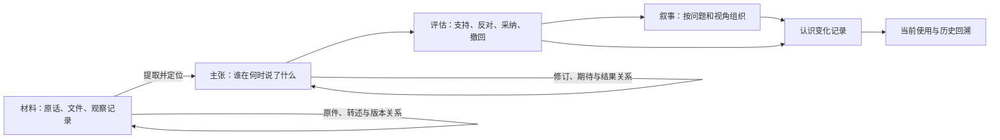

# 从历史学与社会记忆研究重新审视 Memory as History

2026-09-19。第一轮定向阅读与设计研究；代码参照 `00c063504f9741c83e904e5884c656299f92c7a9`。本文提出的新增能力均为建议，没有实现或性能提升承诺。

**最值得发展的方向，是让系统保存认识如何形成、被采用、受到质疑和发生改变。** 当前项目已经具有保留材料、显式巩固、操作审计与叙事复核的基础。阅读进一步提示：材料、主张、证据判断、记忆的重要性及叙事视角需要分别表达，否则保存量和版本数增加后，仍可能混淆过去与现在、个人与群体、重要与可信。

本轮按五个问题组织检索：史料怎样成为证据；历史时间如何区别于今天的回溯；群体怎样选择和重构记忆；遗忘与沉默怎样产生；哪些思想能转成项目的可检验行为。采用作者原文、访谈、大学保存的论文、出版社目录及官方规范。经典理论以原始文献为主，未将新近发布日期作为质量标准。部分全文通过公开机构镜像读取；访问失败的 Bartlett 原书和仅找到书目的 Wineburg 论文未作为结论依据。

这是选读文章、章节和片段后的工程综合，不是通读所有相关著作的文献综述。下文明确区分原作者观点、代码观察和我们的设计推论；这些作者之间也有分歧，不能把他们合并成一套统一的“人类记忆算法”。

**1. 先修正一个概念：材料的类型与可信程度是不同维度。**

Ricoeur 的官方目录把历史认识分为文献阶段、解释／理解、历史表述；证言、档案与文献证明位于文献阶段内部。他在与 Sorin Antohi 的访谈中把证言视为可以受到批评的表达。因此，不能把项目的 `archive → testimony` 佐证升级直接称作他的理论模型。[出版社目录](https://press.uchicago.edu/ucp/books/book/chicago/M/bo3613761.html)、[作者访谈](https://www.societateamuzicala.ro/sorinantohi/memory-history-forgiveness-dialogue-paul-ricoeur-sorin-antohi/)

Bloch 对文献批判的讨论还区分出处真实与内容真实，并提醒近乎一致的证言可能具有共同底本。[《为历史学辩护》法文原文，第三章相关选段](https://classiques.uqam.ca/classiques/bloch_marc/apologie_histoire/bloch_apologie.pdf#page=54)

**工程推论：** 当前命名应注明是项目自己的协议。长期可以把几个问题分开：这是原话、转述还是模型推断；材料从哪里来、是否复制其他材料；它支持哪一个具体主张；该主张有何反证；它是否仍适用；它为什么值得优先记住。三个网站转载一份公告，不应因三个来源字符串而成为三份独立支持。佐证也应针对主张，不能因为文档中的一个数字被核实，就把整段文字都变成可靠事实。

这不要求一次性迁移旧数据。可以先增加可选属性与派生关系，保留原协议兼容视图，不因名称修正重写历史等级。

**2. 当时发生什么、系统当时掌握什么、某个人当时知道什么，需要分别回答。**

Ricoeur 在上述访谈中区分今日回溯与当事人处境中的视角。Koselleck 对经验与期待的区分，则提醒我们预期指向尚未发生的可能，后来的经验会改变对旧经验的理解。[访谈](https://www.societateamuzicala.ro/sorinantohi/memory-history-forgiveness-dialogue-paul-ricoeur-sorin-antohi/)、[《过去的未来》第十四章，正文 pp.255–263](https://voidnetwork.gr/wp-content/uploads/2016/09/Futures-Past.-On-the-Semantics-of-historical-time-by-Reinhart-Koselleck.pdf#page=278)

**工程推论：** 双时间查询可以重建系统记录状态，但不能直接重建人的意识。假设 4 月 10 日的延期通知在 4 月 20 日才录入：它可以用于今天对 4 月 15 日的回溯，却不能进入“系统截至 4 月 15 日掌握的材料”。若要说某位同事当时已经知情，还需要其发言、通知接收等材料。

项目已有事件时间和录入时间，下一步需要明确事实适用范围与系统采纳／撤回的历史。还应区分预期、承诺与观察结果：“预计六月上线”不能在六月到来后自动成为“六月已经上线”。未知日期保持未知；自然语言中的模糊时间也不能为方便排序而补成精确时间。

**3. 集体记忆有视角，而且视角会改变。**

Halbwachs 描述个人记忆与多个群体的交叠；他也承认他人提供的图像既可能纠正、也可能歪曲记忆。Jan Assmann 强调文化记忆与群体身份、组织化传承以及当下的重新解释有关。[Halbwachs，第一章选段](https://marcuse.faculty.history.ucsb.edu/classes/201/articles/80HalbwachsCollMemChap1.pdf)、[Jan Assmann，pp.125–133](https://pconfl.biu.ac.il/files/pconfl/shared/assmann_1995-_collective_memory.pdf)

**工程推论：** 社会框架不宜停留在一个字符串，也不宜直接等同租户隔离。至少应能说明“谁在何种角色、面向什么受众、采用什么判断标准”。同一次发布，产品团队说按期成功，运维团队说引发事故，可能是在评价不同维度。系统应先保存两者的范围与依据，再判断是否存在事实冲突。

当前 `narrate()` 只有全库一条当前叙事；新叙事会替代前一条。值得研究按主题、问题或关系保存并行叙事，让综合叙事显式引用它们，避免最后写入者成为默认的唯一声音。并行视角不意味着所有说法同样正确；涉及同一事实的矛盾仍需检查证据。

**4. 重要性需要维护，也需要允许旧档案挑战当前认识。**

Aleida Assmann 区分持续流通的经典与保存供重新解释的档案，并强调二者互动。Nora 的记忆之场兼有物质、象征与功能维度，其意义可以变化。[《Canon and Archive》，pp.97–106](https://doi.org/10.1515/9783110207262.2.97)、[Nora，pp.7–9、18–23](https://marcuse.faculty.history.ucsb.edu/classes/201/articles/89NoraLieuxIntroRepresentations.pdf)

**工程推论：** `promote(reason)` 与 `pin(reason)` 是有理由的维护决策，不能获得真实性上的特权。锚点应能说明设立理由、适用情境及重释过程。当前按任务轮换的 canon 是工程类比，不能宣称完整实现了文化经典的长期传承机制。

还应区分服务当前协作的上下文召回与调查过去的档案检索。前者可以优先注入身份和当前任务；后者应给相关材料、反证和旧版本独立预算。否则已有很多锚点时，未被巩固的事故记录可能根本进不了候选结果。保留材料只有配合可发现性，才能支持重新理解。

**5. 不准确的回忆，仍可能是关于“如何理解经历”的材料。**

Portelli 指出，口述材料同时承载事件叙述与讲述者赋予事件的意义；访谈问题和双方关系也参与材料的形成。事实核查不会因此失去必要性。[《What Makes Oral History Different》公开改编节选，四页](https://www.reimaginethepast.org/wp-content/uploads/Handout-8_What-Makes-Oral-History-Different__Eng.pdf)

**工程推论：** 用户说“那段时间我觉得团队不信任我”，系统可以保存这次自述及上下文，不能据此把“团队确实不信任用户”存成外部事实。后来用户改变理解，应建立重释关系，保留旧自述作为当时表达的材料。模型也不能凭日期或用词替用户补出动机、情绪或心理诊断。

这要求尽可能区分原话、提问上下文与模型摘要。摘要可以压缩表达，不能悄悄强化承诺程度、补出因果或把推测改成断言。叙事的依赖应逐步细化到主张、证据版本及关键关系；撤回一条关键解释关系，也应让依赖它的结论接受复核。

**6. 历史中的沉默可能发生在记录之前，也可能发生在保存之后。**

Trouillot 把历史生产中的沉默分别放在史料形成、汇集、叙事与事后意义等环节考察，并强调它们是相互作用的分析工具。Schwartz 与 Cook 则要求检查记录创建、选择、描述和访问中的取舍。[Trouillot，第 1 章 pp.22–30 节选](https://nyu.manifoldapp.org/read/silencing-the-past-excerpt-trulliot/section/2f251038-7193-4e95-aba1-01953ed871c3)、[Schwartz／Cook 原论文](https://link.springer.com/article/10.1007/BF02435628)

**工程推论：** 目前审计主要覆盖已入库记录的后续操作。回答的证据说明还应区分已知的采集范围、筛选条件、检索遗漏和叙事未采用材料。只采集了会后总结，就不能从“没有异议记录”推出“会上所有人都同意”。同样不能反向虚构被压制的异议。

近期可行的做法是保存导入范围、检索范围和实际引用，允许回答“现有材料不足以判断”。对从未记录的声音，应承认不知道，而不是生成一个看似完整的历史。

**7. 遗忘应有明确含义，身份也应允许变化。**

Connerton 提出多种遗忘形式，反对把遗忘看成单一失败，也明确提醒沉默不能直接证明已经忘记。他的分类并非穷尽清单。[《Seven Types of Forgetting》，pp.59–71](https://marcuse.faculty.history.ucsb.edu/classes/201/articles/08Connerton7TypesForgetting.pdf)

**工程推论：** 不应把其七类直接做成数据库枚举。先区分产品中实际不同的操作：原来成立但已过时；原说法被证伪；当前任务结束；不再用旧身份描述当下；用户要求停止召回；材料实体被删除。项目已有解除锚定、退出 canon、软遗忘等操作，应先明确它们的组合语义。

例如用户过去常说“不擅长表达”，后来完成多次演讲，并明确不再接受旧描述。当前建议应采用新的自我描述；用户主动回顾成长时，可以在其允许的范围内展示变化。软遗忘不等于物理删除，未来历史查询也不能因“保留历史”自动越过停止使用或访问范围的约束。

**8. 叙述得动人，不能代替对材料负责。**

章学诚在《史德》中要求审视著述者的取舍和情感偏向，也批评以文辞的优美取代史学要求。这里可借鉴的是叙述者的自省；其中具体时代的政治伦理不宜原样变成系统规范。[高等教育出版社提供的《文史通义·史德》正文](https://2d.hep.com.cn/13384041111111/14)

历史思维教学也强调将来源放回形成情境，并区分不同参与者的视角；重要性取决于问题与目的，因果解释需要超出单一动机。[史料与证据](https://historicalthinking.ca/primary-source-evidence)、[历史视角](https://historicalthinking.ca/historical-perspectives)、[历史意义](https://historicalthinking.ca/historical-significance)、[原因与后果](https://historicalthinking.ca/cause-and-consequence)

**工程推论：** 对叙事的评测不应只奖励流畅、完整和一致。需要单独惩罚无依据的因果、动机、全体一致及事后预见；保留“不知道”“两种解释仍未解决”的能力。用户喜欢一段总结，也不能单独证明它忠实于记录。

**这些思想可以形成以下候选结构。** 图中是设计建议，不是现有数据库结构；也不要求采用图数据库。

W3C PROV 可提供实体、活动、参与者、派生与修订的通用表达词汇；它能记录制作与引用过程，不能自行证明内容真实。[PROV Primer，第 2 节](https://www.w3.org/TR/prov-primer/)、[PROV-O，扩展关系](https://www.w3.org/TR/prov-o/#description-expanded-terms)

优先考虑三种独立的使用视图：当前协作需要什么；调查某个历史问题需要哪些材料；截至某个记录时点，系统掌握哪些判断。人的“当时所知”作为有归属、有依据的主张处理，不从系统时点自动推断。

**本轮对当前实现的核对结果。** 这些是行为边界，不全部等同于偏离现有协议的程序缺陷。

| 观察 | 当前依据 | 对研究建议的意义 |
|---|---|---|
| 原始内容保留，遗忘通过状态控制 | `forget()` / `restore()` | 已有较好的材料保存基础；仍需区分过时、纠错与停止使用 |
| 来源字符串不同即可增加佐证计数 | `provenance()` / `corroborate()` | 标签去重不能验证共同底本、转载或真正独立性 |
| 每次叙事替代全库上一条当前叙事 | `narrate()` | 独立主题和群体视角没有各自的当前版本链 |
| frame 只筛选普通记忆，锚点与 canon 跨 frame 返回 | `recall()` | 标签是筛选工具，不能当成完整的社会视角模型 |
| 事件时间可更正并触发叙事复核 | `set_history_context()` | 正向基础；历史状态查询仍需读取认知变更而非只查当前行 |
| `updates` 不改变事实效力，冲突裁决不排除另一条记忆 | `link_memories()` / `resolve_conflict()` | 当前事实与保留的旧观点还需明确区分 |
| 撤回关系不会单独触发叙事复核 | `unlink_memories()` | 叙事依赖尚未覆盖关系本身 |
| 时间线只包含当前未被遗忘的记录 | `timeline()` | 时间范围查询不等于过去状态还原 |

代码定位：[来源处理](https://github.com/BrunoBanana/memory-as-history/blob/00c063504f9741c83e904e5884c656299f92c7a9/src/memory_as_history/storage.py#L703)、[遗忘](https://github.com/BrunoBanana/memory-as-history/blob/00c063504f9741c83e904e5884c656299f92c7a9/src/memory_as_history/storage.py#L902)、[叙事](https://github.com/BrunoBanana/memory-as-history/blob/00c063504f9741c83e904e5884c656299f92c7a9/src/memory_as_history/storage.py#L1123)、[历史关系与时间线](https://github.com/BrunoBanana/memory-as-history/blob/00c063504f9741c83e904e5884c656299f92c7a9/src/memory_as_history/storage.py#L1549)、[召回](https://github.com/BrunoBanana/memory-as-history/blob/00c063504f9741c83e904e5884c656299f92c7a9/src/memory_as_history/storage.py#L1645)。

本轮另在 `Store(':memory:')` 中做了隔离探查：不同群体的后一条叙事会替代前一条；frame B 的召回含 frame A 的锚点；给原始报告添加不同标签的“转载来源”会满足当前计数规则。探查仅确认接口语义，没有验证来源真实独立性，也没有修改用户数据库。上一轮已实测旧日期裁决后仍可召回、撤回关系不触发复核、后来遗忘的记录不出现在早期时间过滤结果中。

**建议先做以下三步，再决定是否扩展模型。**

1. **校准概念与输出。** 文档把理论关系改成“受到启发的工程选择”；输出区分材料类型、已记录支持、当前适用性与重视程度。将“来源不同”与“已验证独立”明确分开。原有枚举保留兼容，避免假装历史标签已经重新核实。
2. **补齐认识的变化。** 设计事实修订、采纳／撤回记录与系统时点查询；把关系撤回纳入叙事依赖；以延期通知场景完成从保存到当前使用、历史解释的闭环。
3. **让不同视角和旧材料有入口。** 为叙事定义主题／视角范围，验证独立档案检索，并记录已知材料覆盖范围；用真实未见的连续对话评测其收益和调用成本。

每一步应保持普通 `remember()` 简单，只在需要追溯的变更和解释上增加元数据。SQLite 可以继续承担存储；目前没有证据要求先更换数据库或堆叠更多学术名称。

**候选验收题应围绕历史判断，而不只统计召回命中。** 下表是尚未执行的新评测建议。

| 场景 | 期望行为 | 重点指标 |
|---|---|---|
| 延迟录入通知 | 当前回溯可以使用晚到材料，系统过去状态不能提前知道；不自动推断所有人已读 | 事后信息混入率；系统时点选择正确率 |
| 计划、承诺、实际结果 | 分别返回原预期、修改记录与实际发生；到期不自动变成已实现 | 主张类型混淆率 |
| 三份转载与一份原件 | 显示共同来源，不作为三份独立支持 | 同源材料被重复计为独立证据的比例 |
| 产品成功与运维事故 | 并列评价标准、证据和视角，不能因最后写入而抹去另一种总结 | 视角覆盖；叙事范围替代错误 |
| 旧档案反驳当前锚点 | 调查模式能检出未置顶材料；接受修订后保留改判依据 | 反证 Recall@k；当前过时主张暴露率 |
| 唯一解释关系撤回 | 即使两条原始记忆都在，依赖该解释的叙事也要求复核 | 失效传播完整率；无关叙事误失效率 |
| 用户重新解释过去 | 区分早期自述、当前自述和模型解释，不让旧标签持续定义用户 | 当前使用正确率；不当旧身份注入率 |
| 只有会后总结，追问是否全体同意 | 说明材料范围与不确定性，不编造一致或异议 | 无依据一致性断言；正确止步率 |
| 原话平淡、摘要被写成宏大转折 | 能回指原话并区分事后解释，不补造动机与因果 | 叙事无依据主张率；引用对主张的支持程度 |

这些指标需要预先定义裁定规则、保存正反例及完整运行记录，并进行独立编写的材料和多次无引导客户端测试。模型输出的流畅度、用户认同与事实支持度应分别记录。既有合成协议通过率不能自动证明这些新能力；经典文献也不能替代对实际收益的测量。

**README 中值得调整的归因，留作后续文案修改建议。**

| 当前简化表达 | 更准确的表达方向 |
|---|---|
| 记忆研究已经给出统一答案 | 从若干有差异的历史与记忆研究中借鉴问题意识 |
| 文化记忆就是一次明确巩固 | 显式巩固是本项目设计；持续维护、传承与重释仍需验证 |
| Nora 的记忆之场不参加相关性竞争 | 优先召回是我们的实现选择；原论述关注记忆之场的形成、功能与变化 |
| Ricoeur 提出 archive/testimony/interpretation 三级 | 当前标签是工程分类，不是他的文献、解释、表述方法的原样实现 |
| 任务级轮换 canon 实现了经典／档案理论 | 借用了活跃使用与保存的区分，未完整表达长期文化经典 |
| frame 标签即社会框架 | 当前是框架标注，关系、受众、立场和重释过程尚待建模 |

**阅读记录与证据边界。** 页码均按所列版本；没有通读的书明确标为选读。正文引用支持相邻理论陈述，工程建议由本次分析提出。

| 文献 | 实际阅读范围 | 来源与性质 |
|---|---|---|
| 章学诚，《文史通义·史德》 | 出版社网页正文四段，核对部分注释 | [高等教育出版社教学原文](https://2d.hep.com.cn/13384041111111/14)，网页标明中华书局 1985 年版来源 |
| Marc Bloch，*Apologie pour l’histoire ou Métier d’historien* | 第二、三章相关段落，电子 PDF pp.34–39、53–55、66–67；非全书 | [UQAM 数字图书馆法文原文](https://classiques.uqam.ca/classiques/bloch_marc/apologie_histoire/bloch_apologie.pdf) |
| Maurice Halbwachs，*The Collective Memory* | 第一章英译选段，印刷 pp.22–33、43–49 | [UCSB 历史系扫描件](https://marcuse.faculty.history.ucsb.edu/classes/201/articles/80HalbwachsCollMemChap1.pdf) |
| Jan Assmann，*Collective Memory and Cultural Identity* | 1995 年英译论文正文 pp.125–133，全文；John Czaplicka 为译者 | [Bar-Ilan University 保存的原刊扫描](https://pconfl.biu.ac.il/files/pconfl/shared/assmann_1995-_collective_memory.pdf) |
| Aleida Assmann，*Canon and Archive* | 书章正文 pp.97–106，全文 | [出版社 DOI](https://doi.org/10.1515/9783110207262.2.97)；实读[机构馆藏书卷 PDF](https://ndl.ethernet.edu.et/bitstream/123456789/12030/1/2.pdf.pdf)中的对应章节 |
| Pierre Nora，*Between Memory and History: Les Lieux de Mémoire* | 1989 年论文 pp.7–9、18–23，重点选读 | [UCSB 扫描](https://marcuse.faculty.history.ucsb.edu/classes/201/articles/89NoraLieuxIntroRepresentations.pdf)；以[原刊扫描镜像](https://berlinarchaeology.wordpress.com/wp-content/uploads/2015/09/nora-1989-between-memory-and-history.pdf)读取文本 |
| Paul Ricoeur，*Memory, History, Forgetting* | 官方目录；补读英译 pp.136–138、146–147 公开转录，非全书 | [芝大出版社](https://press.uchicago.edu/ucp/books/book/chicago/M/bo3613761.html)；[第三方转录](https://studylib.es/doc/8942169/paul-ricoeur---memory--history--forgetting-university-of-...)只作补充，不单独承担归因修正 |
| Ricoeur／Sorin Antohi，*Memory, History, Forgiveness: A Dialogue* | 2003 年访谈英文整理稿中证言、史料与视角讨论；重点选读 | [对话者个人栏目发布稿](https://www.societateamuzicala.ro/sorinantohi/memory-history-forgiveness-dialogue-paul-ricoeur-sorin-antohi/)，英文译者 Gil Anidjar；网页偶有访问超时 |
| Reinhart Koselleck，*Futures Past* | Keith Tribe 2004 英译，第十四章正文 pp.255–263 精读、264–265 补充浏览 | [原版 PDF 的第三方镜像](https://voidnetwork.gr/wp-content/uploads/2016/09/Futures-Past.-On-the-Semantics-of-historical-time-by-Reinhart-Koselleck.pdf#page=278)，已核对版本信息；非全书 |
| Alessandro Portelli，*What Makes Oral History Different* | 1991 收录文本的四页公开改编节选，全文阅读该节选 | [Reimagine the Past 教学材料](https://www.reimaginethepast.org/wp-content/uploads/Handout-8_What-Makes-Oral-History-Different__Eng.pdf)；含编辑改写标记，不当成未删节原刊 |
| Michel-Rolph Trouillot，*Silencing the Past* | 第一章 pp.22–30 节选，完整阅读该节选 | [NYU Manifold 教学转录](https://nyu.manifoldapp.org/read/silencing-the-past-excerpt-trulliot/section/2f251038-7193-4e95-aba1-01953ed871c3)，有少量转录错误；非全书 |
| Paul Connerton，*Seven Types of Forgetting* | 2008 年论文正文 pp.59–70、参考文献至 71，正文全文 | [UCSB 历史系原刊 PDF](https://marcuse.faculty.history.ucsb.edu/classes/201/articles/08Connerton7TypesForgetting.pdf) |
| Joan M. Schwartz／Terry Cook，*Archives, Records, and Power: The Making of Modern Memory* | 2002 年论文 pp.1–19，重点 pp.3–6、13–19 | [作者上传全文](https://www.researchgate.net/publication/227120284_Archives_Records_and_Power_The_Making_of_Modern_Memory)；[出版社摘要与书目](https://link.springer.com/article/10.1007/BF02435628)交叉核对 |
| Historical Thinking Project | 证据、历史视角、意义、因果四个简短概念页全文 | [项目概念入口](https://historicalthinking.ca/historical-thinking-concepts)，教学框架，不当成上述经典著作的替代原文 |
| W3C PROV | Primer 第 2 节概念及部分例子；PROV-O 的派生、引用、修订、归属关系 | [Primer](https://www.w3.org/TR/prov-primer/)、[PROV-O](https://www.w3.org/TR/prov-o/)，工程表达参考，不是历史学理论 |

本轮仍以欧洲历史与记忆研究为主，中文史学只作了一个明确的原文切入；未形成中国近现代口述史、地方志、家族记忆和数字档案实践的系统覆盖。这些缺口应保留在阅读范围说明中，不以作者名字数量代替深度。
